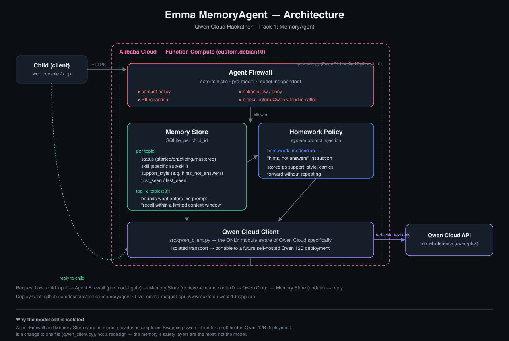

# Emma MemoryAgent

Hackathon entry: **Global AI Hackathon Series with Qwen Cloud** — Track 1: MemoryAgent.

**▶ Demo video (2:19):** https://youtu.be/b3sYJfu5DjA

A child-safe homework and revision companion that **remembers the child's
learning state, not just the chat**: which topic, which specific skill, and
which support style (e.g. "hints, not answers" for homework help that
guides instead of giving the answer away) — and adapts future exercises
from that memory instead of starting from zero. Every request passes
through an **Agent Firewall** (deterministic, pre-model compliance checks)
before it ever reaches the LLM.

## Why this exists

Emma (the broader Talki education product) treats the foundation model as a
replaceable component — the moat is the pedagogical relationship: persistent
memory, anti-repetition, anti-false-praise, and a curriculum that survives a
full model swap. This repo is a standalone proof of that architecture, built
against Qwen Cloud for the hackathon.

For institutional deployments (schools, universities) the same Agent Firewall
+ memory core supports two deployment lanes:

1. **Self-hosted local SLM** (e.g. Qwen 12B on school-owned or fleet hardware)
   — best data locality, works offline, higher ops burden.
2. **Hosted API** (Qwen Cloud here) — fastest path to a working pilot, no
   infrastructure to run, model swappable behind the same firewall.

This build uses lane 2 (Qwen Cloud API, deployed on Alibaba Cloud) because
it's the fastest way to ship a real, judgeable system in the hackathon
window. Lane 1 remains architecturally supported — same firewall, same
memory core, different model transport — and is not foreclosed by this
choice.

## Architecture



See [`docs/architecture.md`](docs/architecture.md) for the full writeup.

```
child input ──► Agent Firewall (deterministic, pre-model)
                     │  age-appropriate content policy
                     │  PII redaction
                     │  action allow/deny rules
                     ▼
              Memory Store (per-child: progress, preferences,
                             anti-repetition ledger)
                     │
                     ▼
              Qwen Cloud API (model call, swappable)
                     │
                     ▼
              response ──► child
```

## Status

Live for the 2026-07-09 submission deadline. See
[`docs/architecture.md`](docs/architecture.md) for the full implementation
status, and the Devpost project page for the current submission draft.

## Deployment

**Live on Alibaba Cloud Function Compute**:
`https://emma-megent-api-uywwrebxfc.eu-west-1.fcapp.run`
(`/healthz`, `/demo/`, `/memory/{child_id}`, and `/chat` — the full
memory-retrieval + homework-hints path against the real Qwen Cloud API —
all serving). Memory is persisted to SQLite at `/tmp` on the function
instance (the only writable path in FC's read-only code mount); a
production deploy would mount a NAS volume for cross-instance persistence.
See
[`deploy/alibaba/README.md`](deploy/alibaba/README.md) and
[`deploy/alibaba/fc-service.yaml`](deploy/alibaba/fc-service.yaml) for the
deployment definition — this is the proof-of-deployment artifact required
by the hackathon rules.

## License

MIT — see [`LICENSE`](LICENSE).
